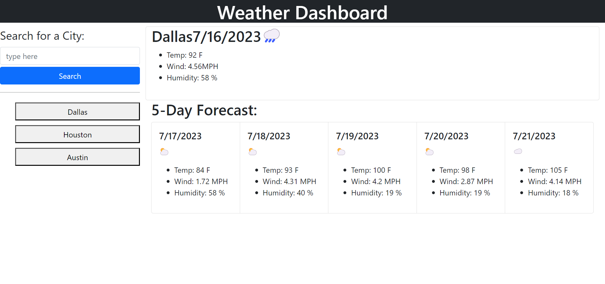

# weather-Dash

## Description
This weather dashboard will allow the user to enter a city into the search bar, which will result in showing a card representing the current date as well as the current weather conditions such as temperature, wind speed, and humidity. Along with that, there will be a five-day forecast that shows the the date and weather statistics for the following 5 days in the city that was searched. Finally, the user will be able to recall back to past cities searched up by clicking the city's name, which will show all of the previous dates and data described. 
 

## Usage
The Password generator can be accessed through here: https://drog41813.github.io/weather-Dash/ 

## Credits
The following site assisted in basic and general JS concepts as well as how to operate JS itself using various methods and syntax: https://www.w3schools.com/js/js_syntax.asp
The following site was used to retrieve the weather API key in order for this webpage to work optimally: https://openweathermap.org/api
The following site helped with learning how to set up various JS algorithms as well as how they affected your code as a whole: https://www.freecodecamp.org/learn/javascript-algorithms-and-data-structures/#basic-javascript
The following individual's github profile indicates partnership in regards to working together and collaborating/sharing constructive ideas with the password generator webpage: https://github.com/LucasWyski001
The following individual's github profile indicates partnership in regards to working together and collaborating/sharing constructive ideas with the password generator webpage: https://github.com/micavilla
The following individual's github profile indicates partnership in regards to working together and collaborating/sharing constructive ideas with the password generator webpage: https://github.com/Rockojoe2
The following individual's github profile indicates partnership in regards to working together and collaborating/sharing constructive ideas with the password generator webpage: https://github.com/mayphamx

## License
MIT License

Copyright (c) 2023 drog41813

Permission is hereby granted, free of charge, to any person obtaining a copy
of this software and associated documentation files (the "Software"), to deal
in the Software without restriction, including without limitation the rights
to use, copy, modify, merge, publish, distribute, sublicense, and/or sell
copies of the Software, and to permit persons to whom the Software is
furnished to do so, subject to the following conditions:

The above copyright notice and this permission notice shall be included in all
copies or substantial portions of the Software.

THE SOFTWARE IS PROVIDED "AS IS", WITHOUT WARRANTY OF ANY KIND, EXPRESS OR
IMPLIED, INCLUDING BUT NOT LIMITED TO THE WARRANTIES OF MERCHANTABILITY,
FITNESS FOR A PARTICULAR PURPOSE AND NONINFRINGEMENT. IN NO EVENT SHALL THE
AUTHORS OR COPYRIGHT HOLDERS BE LIABLE FOR ANY CLAIM, DAMAGES OR OTHER
LIABILITY, WHETHER IN AN ACTION OF CONTRACT, TORT OR OTHERWISE, ARISING FROM,
OUT OF OR IN CONNECTION WITH THE SOFTWARE OR THE USE OR OTHER DEALINGS IN THE
SOFTWARE.
